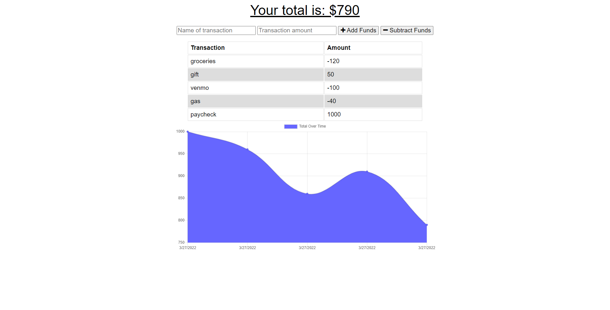

# Budget Tracker
  
  ### Description
  A budgeting app that allows the user to track withdrawals and deposits with or without a data connection.  
  ### Table of Contents
  * [Usage](#usage)
  * [Contributions](#contributions)
  * [Tests](#tests)
  * [Links](#links)
  * [Screenshot](#screenshot)
  * [Questions](#questions)
  ### Usage
  Users can add withdrawals or deposits while offline. Once the application detects an internet connection the cached data will be added to the transaction history.
  ### Contributions
  Contributions coming soon!
  ### Tests
  Tests coming soon!
  ### Links
  Check out the deployed link [here](https://shrouded-lake-11820.herokuapp.com/)  
  ### Screenshot
  
  ### Questions
  If you have additional questions, you can contact me here: knharman@gmail.com

  Check out my GitHub: [knharman](https://github.com/knharman)